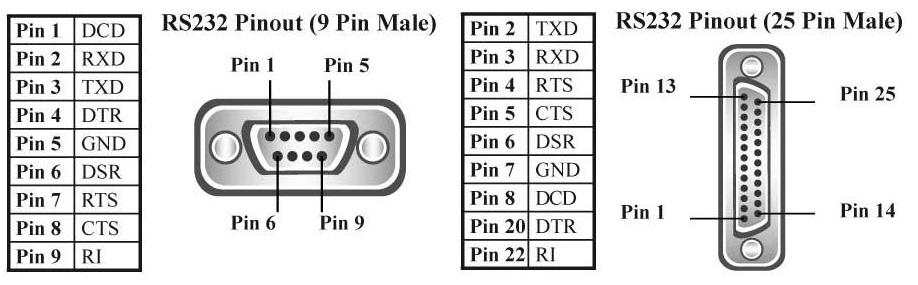

# RS232

A simple bridge for control I/O pin serial port RS232
and I/O serial communication.

<br>

<br>


```cpp
	/* sample I/O */

	RS232 rs;
	rs.setup("/dev/ttyUSB0");

	rs.set_pin( RTS, HIGH );
	rs.get_pin( RTS );
	rs.exit();
```
<br>
<b>run example:</b>

```bash
	./bin/example-led /dev/your-port
	./bin/example-button /dev/your-port
```
